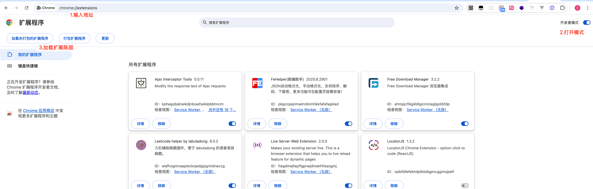
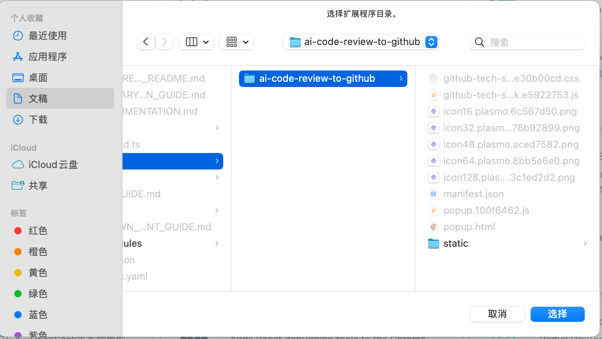
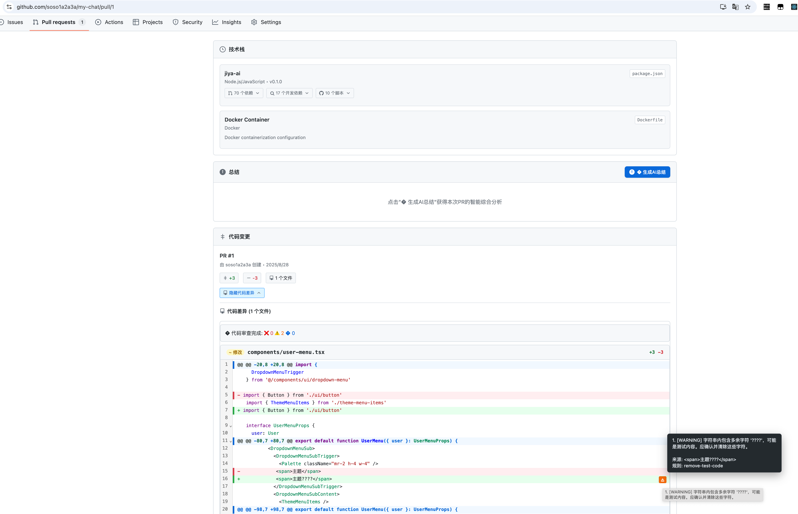
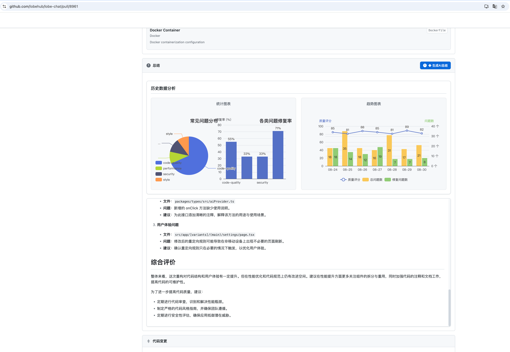
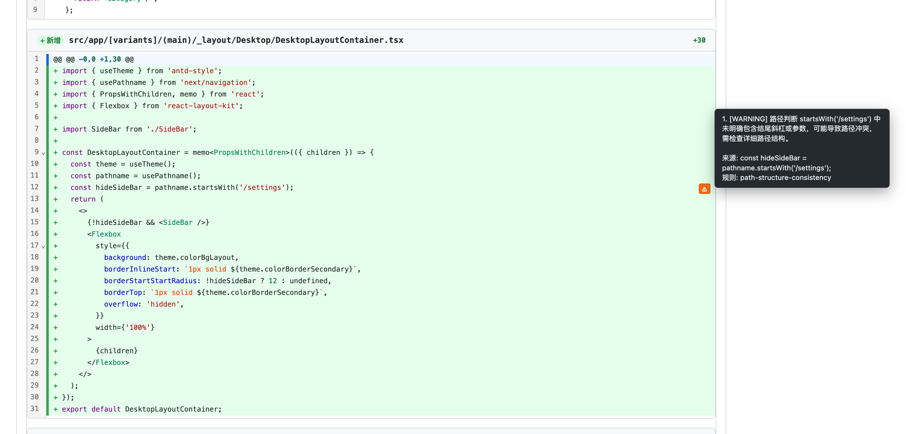
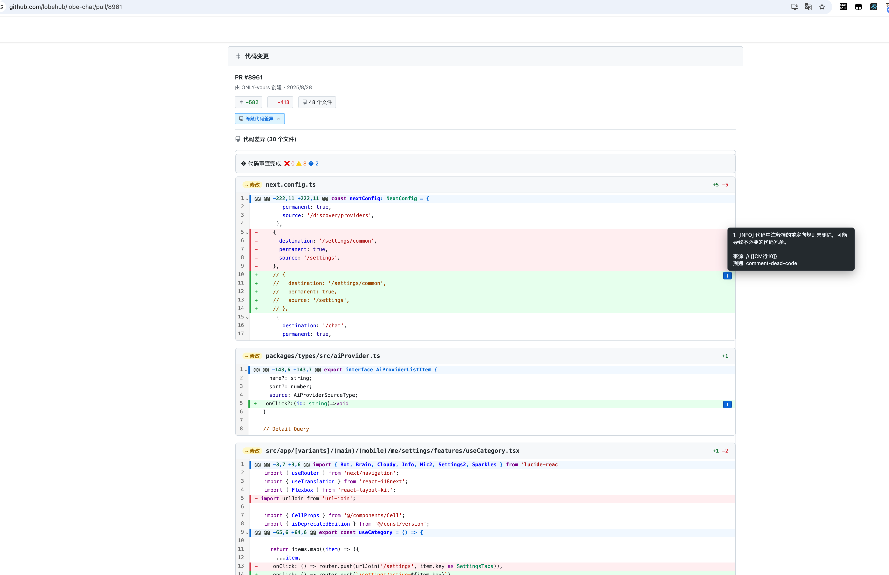
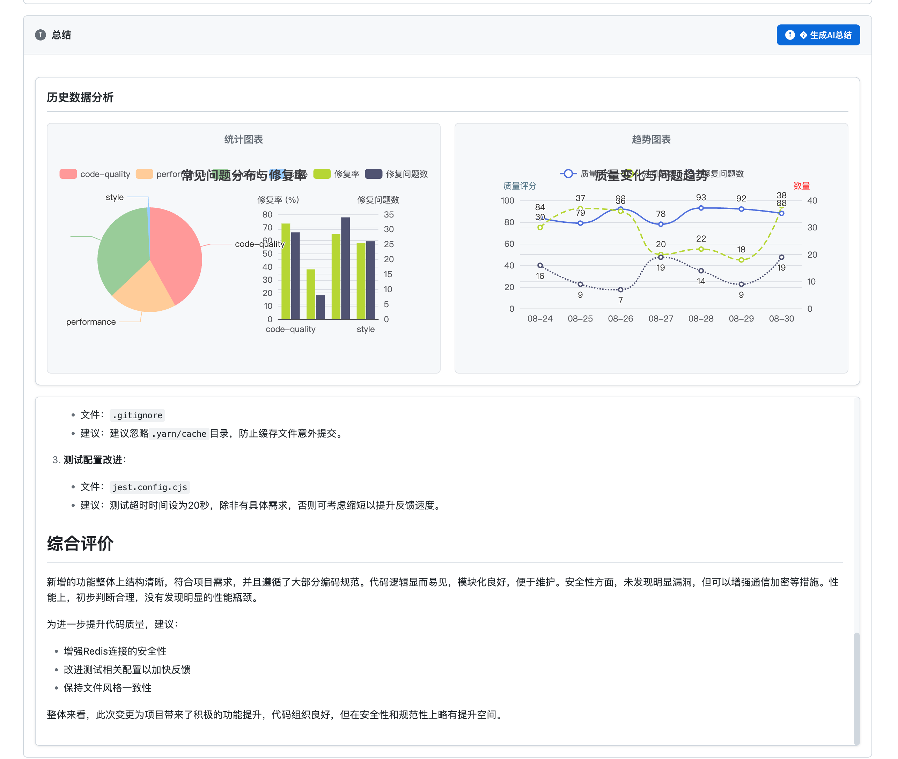
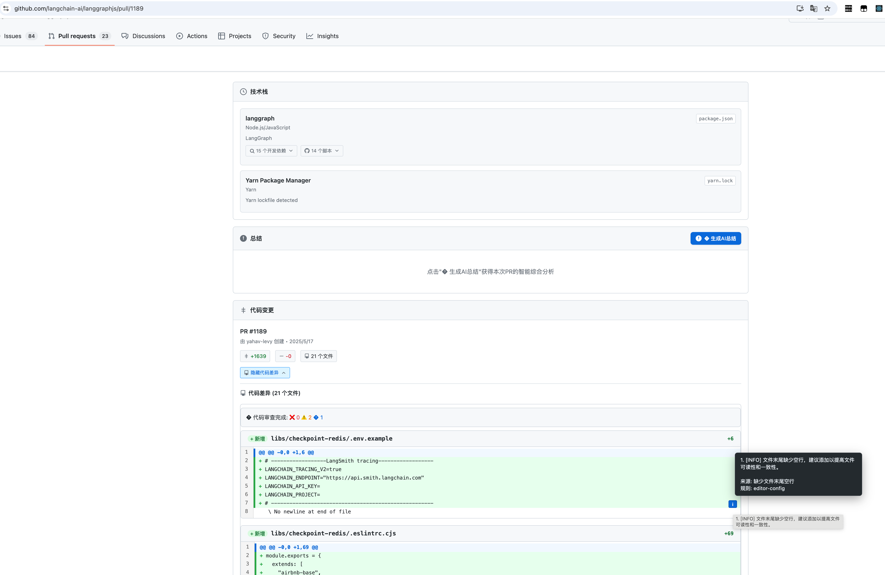

## ai-code-review-to-github 使用说明：

### 操作步骤 

0. 先解压，把同文件下‘ai-code-review-to-github’上传到chrome 中

1. 
2. 
3. 访问相应**公共的GitHub**，pull request
   1. https://github.com/lobehub/lobe-chat/pull/8961
   2. https://github.com/soso1a2a3a/my-chat/pull/1
   3. https://github.com/fastapi/fastapi/pull/14017等等
4. 会自动加载diff code, 并标记有问题pr
5. 点击生成‘总结’，包含历史数据和总结

## 最终效果

## 注意

1. 只在chrome 测试过
2. 当前只支持GitHub pull requests
3. 模型资源有限，偶尔可能会处理不了，请再次尝试