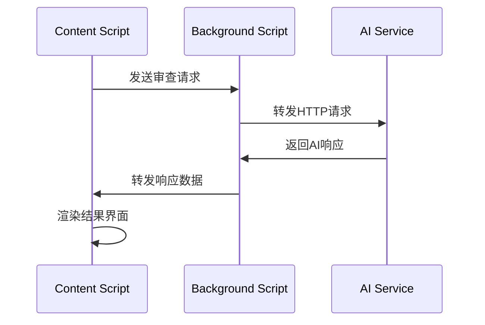

# AI功能配置详解

## 🤖 AI集成架构

### 服务端配置
- **API基地址**: `http://115.190.121.185:3000`
- **协议**: HTTP (建议升级到HTTPS)
- **架构**: RESTful API + Server-Sent Events

### 客户端架构
```
AI Service Layer
├── ai-config.js      # 配置管理
├── ai-service.js     # 服务客户端
├── background.js     # 代理和流式处理
└── content.js        # UI集成
```

## 📡 API接口详情

### 1. 代码审查接口
```
POST /api/review
Content-Type: application/json

{
  "system": "代码审查系统提示词",
  "prompt": "用户代码审查请求",
  "model": "gpt-3.5-turbo",
  "description": "代码变更描述"
}
```

**响应格式**:
```json
{
  "issues": [
    {
      "type": "quality|security|performance|style",
      "severity": "high|medium|low",
      "message": "问题描述",
      "suggestion": "改进建议",
      "line": 42,
      "file": "src/example.js"
    }
  ],
  "summary": "整体审查摘要"
}
```

### 2. 流式聊天接口
```
POST /api/stream
Content-Type: application/json
Accept: text/event-stream

{
  "message": "用户消息",
  "model": "gpt-3.5-turbo"
}
```

**SSE响应格式**:
```
data: {"type": "text-start", "content": ""}
data: {"type": "text-delta", "content": "AI响应内容片段"}
data: {"type": "text-end", "content": ""}
data: [DONE]
```

### 3. 摘要生成接口
```
POST /api/summary
Content-Type: application/json

{
  "system": "摘要生成系统提示词",
  "prompt": "需要摘要的内容",
  "model": "gpt-3.5-turbo"
}
```

## 🎯 AI功能模块

### 1. 代码审查模块
**触发场景**:
- GitHub Pull Request页面
- GitHub Commit页面
- 用户手动触发

**分析维度**:
- **代码质量**: 命名规范、结构设计、最佳实践
- **安全问题**: 漏洞检测、权限校验、输入验证
- **性能优化**: 算法效率、资源使用、缓存策略
- **可维护性**: 代码复杂度、注释完整性、模块化

**实现流程**:
```javascript
// 1. 获取代码变更
const changes = await githubClient.getPullRequestFiles(owner, repo, prNumber);

// 2. 格式化代码变更
const formattedChanges = aiService.formatCodeChanges(changes);

// 3. 调用AI审查
const review = await aiService.reviewCode(formattedChanges, repoInfo);

// 4. 渲染审查结果
renderReviewResults(review);
```

### 2. 技术栈分析模块
**检测文件类型**:
- `package.json` → Node.js生态
- `requirements.txt` → Python依赖
- `pom.xml` → Java Maven项目
- `build.gradle` → Java Gradle项目
- `Cargo.toml` → Rust项目
- `composer.json` → PHP项目
- `Gemfile` → Ruby项目
- `go.mod` → Go模块

**分析内容**:
- 主要技术栈识别
- 依赖版本分析
- 安全漏洞检测
- 升级建议

### 3. 智能摘要模块
**应用场景**:
- Commit变更摘要
- PR影响分析
- 技术文档总结
- 历史数据分析

## 🔧 配置管理

### 用户配置
```javascript
// 存储在Chrome Storage中
{
  "githubToken": "用户GitHub Token",
  "aiModel": "gpt-3.5-turbo",
  "autoReview": true,
  "reviewLanguage": "zh-CN"
}
```

### 模型配置
```javascript
const MODELS = {
  GPT_3_5_TURBO: {
    name: 'gpt-3.5-turbo',
    maxTokens: 4096,
    temperature: 0.3,
    suitable: ['code-review', 'summary']
  },
  GPT_4: {
    name: 'gpt-4',
    maxTokens: 8192,
    temperature: 0.3,
    suitable: ['complex-analysis', 'architecture-review']
  },
  CLAUDE_3: {
    name: 'claude-3',
    maxTokens: 100000,
    temperature: 0.3,
    suitable: ['long-context', 'detailed-analysis']
  }
};
```

## 📝 提示词工程

### 代码审查提示词
```javascript
const CODE_REVIEW_PROMPT = {
  system: `你是一个专业的代码审查助手。请分析提供的代码变更，并提供以下方面的反馈：

1. **代码质量**：
   - 命名规范和代码风格
   - 设计模式和架构选择
   - 代码重复和复杂度

2. **安全性**：
   - 潜在的安全漏洞
   - 输入验证和权限控制
   - 敏感信息泄露风险

3. **性能优化**：
   - 算法时间复杂度
   - 内存使用效率
   - 数据库查询优化

4. **可维护性**：
   - 代码可读性
   - 注释和文档
   - 测试覆盖率

请用中文回复，保持专业和建设性的语气。对于每个问题，提供具体的改进建议和最佳实践。`,

  template: `请审查以下代码变更：

**仓库信息**：
- 项目：{owner}/{repo}
- 分支：{branch}
- 提交：{commit}

**变更文件**：
{changedFiles}

**代码差异**：
{codeDiff}

请提供详细的代码审查意见，包括问题定位、严重程度评估和具体的改进建议。`
};
```

### 技术栈分析提示词
```javascript
const TECH_STACK_PROMPT = {
  system: `你是一个技术栈分析专家。请基于项目配置文件分析技术栈构成，并提供专业的评估和建议。

分析维度包括：
1. 技术栈识别和版本分析
2. 依赖安全性评估
3. 架构合理性分析
4. 升级和优化建议`,

  template: `请分析以下项目的技术栈：

**项目信息**：
- 项目名称：{projectName}
- 仓库：{owner}/{repo}

**配置文件**：
{configFiles}

**依赖列表**：
{dependencies}

请提供技术栈摘要、安全评估和优化建议。`
};
```

## 🔄 数据流处理

### 请求流程


### 流式响应处理
```javascript
// Background Script
async function handleStreamChat(port) {
  const response = await fetch(apiUrl, {
    method: 'POST',
    headers: { 'Content-Type': 'application/json' },
    body: JSON.stringify(requestData)
  });

  const reader = response.body.getReader();
  const decoder = new TextDecoder();

  while (true) {
    const { done, value } = await reader.read();
    if (done) break;

    const chunk = decoder.decode(value, { stream: true });
    const lines = chunk.split('\n');
    
    for (const line of lines) {
      if (line.startsWith('data: ')) {
        const data = JSON.parse(line.substring(6));
        port.postMessage({ type: 'chunk', chunk: data });
      }
    }
  }
}
```

## 🛡️ 错误处理

### 错误类型
1. **网络错误**: 连接超时、DNS解析失败
2. **API错误**: 服务器错误、格式错误
3. **认证错误**: Token无效、权限不足
4. **限流错误**: 请求频率过高

### 错误恢复策略
```javascript
class ErrorHandler {
  async handleError(error, context) {
    switch (error.type) {
      case 'NETWORK_ERROR':
        return this.retryWithBackoff(context);
      case 'RATE_LIMIT':
        return this.waitAndRetry(context);
      case 'AUTH_ERROR':
        return this.promptForReauth(context);
      default:
        return this.showErrorMessage(error.message);
    }
  }
}
```

## 📊 性能优化

### 缓存策略
- **技术栈分析**: 缓存24小时
- **代码审查结果**: 按文件hash缓存
- **用户配置**: 本地存储

### 请求优化
- **批量处理**: 合并小文件的审查请求
- **增量分析**: 只分析变更的代码片段
- **并行处理**: 多文件同时分析

### 资源管理
```javascript
class ResourceManager {
  constructor() {
    this.requestQueue = [];
    this.activeRequests = new Set();
    this.maxConcurrent = 3;
  }

  async addRequest(request) {
    if (this.activeRequests.size < this.maxConcurrent) {
      return this.executeRequest(request);
    } else {
      this.requestQueue.push(request);
    }
  }
}
```

## 🔮 扩展性设计

### 插件化架构
```javascript
class AIPluginManager {
  constructor() {
    this.plugins = new Map();
  }

  registerPlugin(name, plugin) {
    this.plugins.set(name, plugin);
  }

  async executePlugin(name, context) {
    const plugin = this.plugins.get(name);
    return plugin ? await plugin.execute(context) : null;
  }
}
```

### 模型适配器
```javascript
class ModelAdapter {
  static createAdapter(modelType) {
    switch (modelType) {
      case 'openai':
        return new OpenAIAdapter();
      case 'anthropic':
        return new AnthropicAdapter();
      case 'custom':
        return new CustomModelAdapter();
      default:
        throw new Error(`Unsupported model: ${modelType}`);
    }
  }
}
```

## 📈 监控和分析

### 使用统计
- API调用次数和成功率
- 用户交互行为分析
- 功能使用频率统计

### 性能指标
- 请求响应时间
- 错误率和类型分布
- 用户满意度评分

通过这套完整的AI配置系统，插件能够提供专业、智能的代码审查服务，大大提升开发者的工作效率和代码质量。
